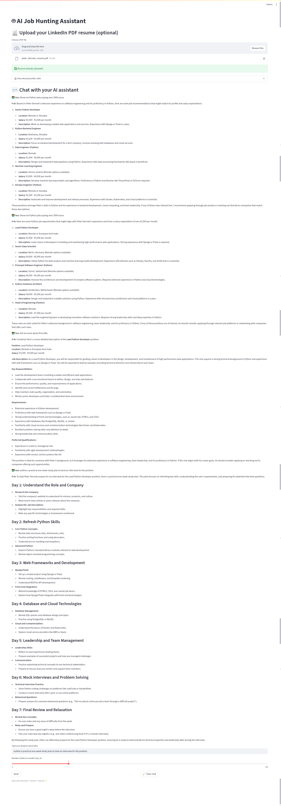

# 🤖 ronnie-frontend-python

Streamlit-based frontend for the **Ronnie AI Job Hunting Assistant**, built to help users upload their LinkedIn PDF resume and chat with an AI assistant to find jobs.

---

## 📦 Features

✅ Upload and parse LinkedIn PDF resumes  
✅ Display extracted profile JSON  
✅ Chat interface to ask job-related questions  
✅ Choose how many top job recommendations to fetch (`top_k`)  
✅ Clean, simple Streamlit UI

---

## 🚀 Getting Started

### 1. Clone the repository
```bash
git clone https://github.com/yourusername/ronnie-frontend-python.git
cd ronnie-frontend-python
```

### 2. Install dependencies
We recommend using a virtual environment:
```bash
python -m venv venv
source venv/bin/activate  # On Windows: venv\Scripts\activate
pip install -r requirements.txt
```

> **requirements.txt** should include:
> ```
> streamlit
> requests
> ```

### 3. Run the app
Make sure your backend (FastAPI) is running on `http://127.0.0.1:8000`.

Then start the Streamlit frontend:
```bash
streamlit run chat_app.py
```

---

## 🛠 Project Structure

```plaintext
ronnie-frontend-python/
├── images/
│   └── ronnie_ui_screeshot.png
├── chat_app.py
├── requirements.txt
└── README.md
```

---

## 📄 chat_app.py Overview

- Uploads a resume (PDF) and sends it to the backend at `/upload_profile`
- Displays parsed profile JSON returned by the backend
- Provides chat input to ask questions about jobs
- Sends chat history and `top_k` parameter to the backend at `/chat`

---

## ✨ Built With
- [Streamlit](https://streamlit.io/) – Fast web apps in Python
- [FastAPI](https://fastapi.tiangolo.com/) – Backend API
- [OpenAI](https://openai.com/) – AI chat & resume parsing

---

## 📸 Example



---

## 📝 License
This project is licensed under the MIT License.

---

## ❤️ Acknowledgments
Thanks to Streamlit, FastAPI and OpenAI for making this project possible.
